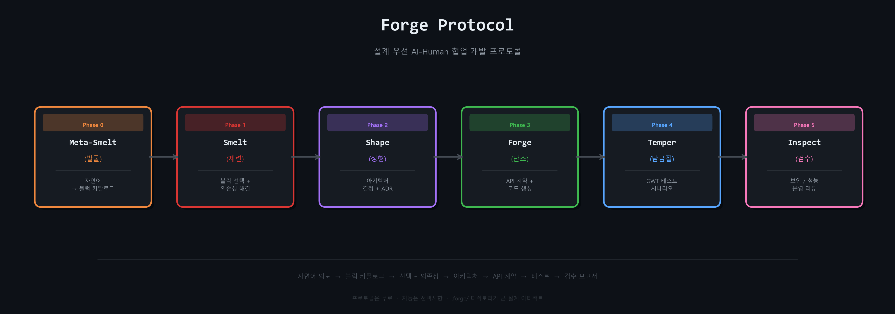

<p align="center">
  <h1 align="center">Forge Protocol</h1>
  <p align="center">
    <strong>설계 우선 AI-Human 협업 개발 프로토콜</strong><br/>
    <em>바이브(감각)에서 시작하되, 설계(구조)로 승격시키고, 검증(증거)으로 마무리한다.</em>
  </p>
  <p align="center">
    <a href="https://github.com/devsmith-kr/forge-protocol/actions"></a>
    <a href="https://www.npmjs.com/package/forge-protocol"></a>
    <a href="https://github.com/devsmith-kr/forge-protocol/blob/main/LICENSE"></a>
    <a href="https://github.com/devsmith-kr/forge-protocol/issues"></a>
  </p>

---

## 왜 Forge인가?

기존 AI 코딩 도구(Cursor, Copilot, Bolt)는 전부 **구현**에서 시작합니다. Forge는 **설계**에서 시작합니다.

- **코드 전에 설계** — 코드 한 줄 쓰기 전에 아키텍처 결정을 강제합니다
- **블럭 기반 아키텍처** — 사람은 필요한 것의 30%만 표현합니다; Forge가 의존성 해결로 나머지 70%를 채웁니다
- **현실 대비** — 개발 시작 전에 비코드 준비물(사업자등록, PG계약, 법률 문서)을 표면화합니다
- **증거 기반** — 모든 Phase가 검증 가능한 아티팩트(YAML, 계약, 테스트 시나리오)를 생성합니다

## 데모

### CLI

```
$ forge init

✔ Forge 프로젝트 초기화 완료!

  Dir: .forge/

  다음 단계: forge meta-smelt — 카탈로그를 설정하세요.

$ forge meta-smelt

  Meta-Smelt  (Phase 0: 발굴)

  ? 카탈로그 방식을 선택하세요:
  ❯ 빌트인 템플릿 사용 (Commerce)
    AI로 커스텀 카탈로그 생성

  ✔ 카탈로그 복사 완료: commerce → .forge/catalog/catalog.yml
  다음 단계: forge smelt
```

```
$ forge smelt

  Phase ━━━━━━━━━━━━━━━━━━━━━━━━━━━━━━━━━━━  Smelt (2/6)

  ◉ 프로젝트에 포함할 블럭을 선택하세요:

  World 1: 고객 & 인증
    [✔] 회원가입 & 로그인
    [✔] 소셜 로그인 (OAuth2)
    [ ] MFA / 2단계 인증

  World 2: 상품 & 카탈로그
    [✔] 상품 관리
    [✔] 카테고리 & 태그
    [✔] 재고 관리   ← 자동 추가됨 (주문 관리의 의존성)

  6개 블럭 선택 → 총 9개 (3개 의존성 자동 해결)

  ✔ intent.yml 저장 완료
```

### Web UI

Web UI는 5단계 전체를 시각적으로 안내합니다.

> 스크린샷과 호스팅 데모는 프로젝트 GitHub 저장소에서 확인할 수 있습니다.

## 두 가지 인터페이스

| | CLI | Web UI |
|---|---|---|
| **스타일** | 터미널 기반, YAML 중심 | 시각적, 드래그앤드롭 |
| **적합 대상** | 개발자, CI/CD 파이프라인 | 기획자, PM, 시각적 사고자 |
| **출력** | `.forge/` 디렉토리 (YAML 파일) | 인터랙티브 Phase 플로우 + ZIP 다운로드 |

## 6단계 프로세스

<p align="center">
  
</p>

| Phase | 이름 | 하는 일 | 출력물 |
|-------|------|---------|--------|
| 0 | **Meta-Smelt** (발굴) | 자연어 → 블럭 카탈로그 | `catalog.yml` |
| 1 | **Smelt** (제련) | 블럭 선택, 의존성 해결 | `intent.yml`, `selected-blocks.yml` |
| 2 | **Shape** (성형) | 기술 스택 결정, ADR 기록 | `architecture.yml` |
| 3 | **Forge** (단조) | API 계약 우선 코드 생성 | `contracts.yml`, `src/` |
| 4 | **Temper** (담금질) | Given-When-Then 테스트 시나리오 | `test-scenarios.yml` |
| 5 | **Inspect** (검수) | 보안 / 성능 / 운영 / 확장성 리뷰 | `forge-report.md` |

## 빠른 시작

### CLI

```bash
# 글로벌 설치
npm install -g forge-protocol

# 프로젝트 초기화
mkdir my-project && cd my-project
forge init          # .forge/ 디렉토리 구조 생성

# 전체 파이프라인 실행
forge meta-smelt    # 빌트인 템플릿 선택 또는 AI 카탈로그 생성
forge smelt         # 블럭 선택 + 의존성 해결
forge shape         # 아키텍처 결정
forge build         # API 계약 (contracts.yml) + Claude 프롬프트
forge temper        # Given-When-Then 테스트 시나리오
forge inspect       # 멀티 관점 검수

# 실제 코드 파일 생성 (Spring Boot 스켈레톤 + JUnit5)
forge emit --target all --build gradle   # gradle | maven 선택
```

### Web UI

```bash
cd web
npm install
npm run dev
# http://localhost:5173 열기
```

Web UI는 5단계 전체를 시각적으로 안내하며, 다음 기능을 제공합니다:
- 의존성 시각화가 포함된 인터랙티브 블럭 선택
- Phase 잠금/해금 제어 (순서 강제, 뒤로는 자유)
- 각 Phase에서 Claude AI 프롬프트 생성
- Spring Boot 스켈레톤 + JUnit5 테스트 코드 생성
- 전체 프로젝트 ZIP 다운로드

## 템플릿

| 템플릿 | 블럭 수 | 의존성 | World 수 | 도메인 |
|--------|---------|--------|----------|--------|
| **Commerce** | 21 | 19 | 6 | 커머스 플랫폼 |

Commerce 템플릿은 의존성 그래프, World(줌 레벨) 구성, 현실 준비물 체크리스트가 포함된 사전 정의 블럭을 제공합니다.

### 커스텀 템플릿 추가

`templates/<your-domain>/`에 `catalog.yml`을 생성하세요:

```yaml
domain: your-domain
worlds:
  - name: World 이름
    bundles:
      - name: 번들 이름
        blocks:
          - id: block-id
            name: 블럭 이름
            description: 이 블럭이 하는 일
            dependencies: [other-block-id]
            priority: must-have | should-have | nice-to-have
```

## 코드 생성

Forge는 프로덕션 수준의 코드 아티팩트를 생성합니다:

- **OpenAPI 3.1 YAML** — 완전한 API 명세
- **Spring Boot 스켈레톤** — Controller / Service / Repository / Entity / DTO
- **JUnit5 테스트 클래스** — Given-When-Then 시나리오 기반
- **빌드 도구 선택** — Gradle(기본) 또는 Maven (`forge emit --build maven`)
- **전체 프로젝트 ZIP** — 모든 것을 한 패키지로 다운로드 (Web UI)

CLI는 `forge emit --target <backend|tests|all>` 로 `.forge/generated/backend/` 에 직접 파일을 기록합니다. CLI와 Web UI는 동일한 `shared/` 생성기를 공유합니다.

## 데이터 모델

```
World (줌 레벨 1)
  └── Bundle (줌 레벨 2)
       └── Block (줌 레벨 3)
            └── TechSpec (줌 레벨 4)
```

매 순간 사용자는 **5개 이하의 선택지**만 봅니다 — 복잡도는 줌 레벨로 관리됩니다.

## 문서

- [시작 가이드 (한국어)](docs/guide-ko.md) — 전체 워크스루 및 CLI 예시
- [Getting Started Guide (English)](docs/guide-en.md) — Full walkthrough with CLI examples
- [기여 가이드](CONTRIBUTING.md) — 템플릿 추가 및 기여 방법
- [상세 스펙](docs/spec.md) — 데이터 모델 및 블럭 스키마 레퍼런스

## 기여하기

기여를 환영합니다! [CONTRIBUTING.md](CONTRIBUTING.md)에서 가이드라인을 확인하세요.

- [버그 리포트](https://github.com/devsmith-kr/forge-protocol/issues/new?template=bug_report.yml)
- [기능 요청](https://github.com/devsmith-kr/forge-protocol/issues/new?template=feature_request.yml)
- [템플릿 요청](https://github.com/devsmith-kr/forge-protocol/issues/new?template=template_request.yml)

## 라이선스

[MIT](LICENSE) &copy; 2026 DevSmith (Jinik)

---

## English

**Forge Protocol** is a "Vibe Coding 2.0" AI-Human collaborative development protocol.

**One-liner**: Start with vibes, elevate to structure, finish with evidence — a design-first AI collaboration protocol.

Existing AI coding tools (Cursor, Copilot, Bolt) all start at implementation. Forge is **the tool that enforces design** — that's the gap.

- **CLI**: `npm install -g forge-protocol` then start with `forge init`
- **Web UI**: `cd web && npm run dev` for a visual interface
- **Fully open-source** (MIT license)
- [Getting Started Guide (English)](docs/guide-en.md)
